# Health, Risk, and Equity
#### Risk Heterogeneity between Black and White Individuals Insured through the ACA Marketplaces from 2018-2020
### Andrew S. Cistola, MPH

### About
Previous research have shown signficiant under-utilization of ambulatory care and signficiantly lower costs among black insured individuals 18-64 from 2014-2018. (doi:10.1001/jamanetworkopen.2022.17383) If these differences persist through the ACA risk adjustment program, under-utilization represents an arbitrage opportunity for insurance providers in the individual market. This would represent how a history of systematic racism and barriers to care could be used for cost-containment measures with the beenfits of overall lower health care costs transferred among the larger population. Health equity efforts should be focused on neutralizing arbitrage opporunties based on defacto discrimination and instead incentivize issuers to address disparities in access to care. With the addition of race and zip code to the EDGE server in 2025, CMS will have the ability to reform the ACA risk adjustmenr program to improve these disparities. The purpose of this study is to identify how the ACA Risk Adjustment program interacts with known health disparities in health care utilization among raical groups. This study uses publcily available data from the Medical Expenditure Panel Survey (MEPS) from Agency for Healthcare Research and Quality (AHRQ) (https://meps.ahrq.gov/mepsweb/data_stats/download_data_files.jsp) from 2018 to 2021 to identify differences in risk that can be attributed to racial group independent of other factors and whether the ACA risk adjustment program excacerbates these diferences. Evidence from this study can identify how racial data can be used by CMS to promote health equity within the ACA marketplaces.

#### Notes:
This analysis serves to fulfill part of the the requirements for the PhD in Public Health-Heath Services Research at the University of Florida. The author is also employed by Blue Cross Blue Shield of Florida.

#### Status: 
In development

#### Reference: 
github.com/andrewcistola/Health-Risk-and_Equity

#### Updated:
2022-11-11 08:29:41.310273

### Import Results
The following files were downloaded from https://meps.ahrq.gov/mepsweb/data_files/pufs/ and saved to a local database:

##### AHRQ MEPS 2020
Household Consolidated File (h224)
Medical Conditions File (h222)
Prescribed Medicines File (h220a)
Dental Visits File (h220b)
Other Medical Expenditures File (h220c)
Hospital Inpatient Stays File (h220d)
Emergency Room Visits File (h220e)
Outpatient Department Visits File (h220f)
Office-Based Medical Provider Visits File (h220g)
Home Health Visits File (h220h)
Home Health Visits File (h220h)
Appendix - Condition to Event File (h220if1)
Appendix - Prescritpion to Condition File (h220if2)

##### AHRQ MEPS 2019
Household Consolidated File (h216)
Medical Conditions File (h214)
Prescribed Medicines File (h213a)
Dental Visits File (h213b)
Other Medical Expenditures File (h213c)
Hospital Inpatient Stays File (h213d)
Emergency Room Visits File (h213e)
Outpatient Department Visits File (h213f)
Office-Based Medical Provider Visits File (h213g)
Home Health Visits File (h213h)
Appendix - Condition to Event File (h213if1)
Appendix - Prescritpion to Condition File (h213if2)

##### AHRQ MEPS 2018
Household Consolidated File (h209)
Medical Conditions File (h207)
Prescribed Medicines File (h206a)
Dental Visits File (h206b)
Other Medical Expenditures File (h206c)
Hospital Inpatient Stays File (h206d)
Emergency Room Visits File (h206e)
Outpatient Department Visits File (h206f)
Office-Based Medical Provider Visits File (h206g)
Home Health Visits File (h206h)
Appendix - Condition to Event File (h206if1)
Appendix - Prescritpion to Condition File (h206if2)

See https://datatools.ahrq.gov/meps-hc#varexpLabel for variable explorer or https://meps.ahrq.gov/mepsweb/data_stats/download_data_files_codebook.jsp?PUFId=H224 for the full varibale list.

### Data Cleaning Summary
Raw data was subset for the following conditions:

##### Households
Individuals 26-64 with marketplace coverage for full year

    SELECT
        2020 AS YEAR # Repeated for each year
        , DUPERSID AS PERSON_ID
        , AGELAST AS AGE
        , SEX
        , RACETHX AS RACE
        , POVCAT20 AS FPL_GROUP
        , POVLEV20 AS FPL_PERCENT
    FROM h224 W # Repeated for each household year file
    WHERE
        AGELAST > 25
        AND AGELAST < 65
        AND PRSTX20 = 1 # Variable name charges for each year
        AND INSCOV20 = 1 # Variable name charges for each year
    

##### Events
Non-Dental events for year individual has marketpalce coverage
 
    SELECT
        2020 AS YEAR # Repeated for each year
        , SQ.DUPERSID AS PERSON_ID
        , 'OUTPATIENT' AS SETTING
        , F.EVNTIDX AS EVENT_ID
        , F.OPFPV20X + F.OPDPV20X AS PAID # Combined Doctor and facility payments from privtae insurers for settings that provided both (variable name changes each year)
    FROM (
        SELECT DISTINCT Y.DUPERSID 
        FROM h224 Y # Repeated for each household year file
        WHERE
            Y.AGELAST > 25
            AND Y.AGELAST < 65
            AND Y.PRSTX20 = 1 # Variable name charges for each year
            AND Y.INSCOV20 = 1 # Variable name charges for each year
        ) SQ
    LEFT JOIN h220f F # Repeated for each event file in year
        ON SQ.DUPERSID = F.DUPERSID

Then paid amounts were summed by person and year and joined to household records (exclduing dental).
The setting of the event for each condition was also collected for each event that documented a ICD10 code.

    

##### Conditions
Any for individual in same year as marketpalce coverage

    SELECT
        2020 AS YEAR # Repeated for each year
        , SQ.DUPERSID AS PERSON_ID
        , Z.CONDIDX AS CONDITION_ID
        , Z.EVNTIDX AS EVENT_ID
    FROM (
        SELECT DISTINCT DUPERSID 
        FROM h224 # Repeated for each household year file
        WHERE
            AGELAST > 25
            AND AGELAST < 65
            AND PRSTX20 = 1 # Variable name charges for each year
            AND INSCOV20 = 1 # Variable name charges for each year
        ) SQ
    LEFT JOIN h220if1 Z # Repeated for each appendix file
        ON SQ.DUPERSID = Z.DUPERSID

All distinct conditions were kept and joined to household records.
    

Final Data for analysis-

<class 'pandas.core.frame.DataFrame'>
Int64Index: 109428 entries, 0 to 109427
Data columns (total 12 columns):
 #   Column        Non-Null Count   Dtype  
---  ------        --------------   -----  
 0   YEAR          109428 non-null  int64  
 1   PERSON_ID     109428 non-null  object 
 2   AGE           109428 non-null  float64
 3   SEX           109428 non-null  float64
 4   RACE          109428 non-null  float64
 5   FPL_GROUP     109428 non-null  float64
 6   FPL_PERCENT   109428 non-null  float64
 7   CONDITION_ID  24750 non-null   object 
 8   EVENT_ID      24750 non-null   object 
 9   ICD10         24750 non-null   object 
 10  SETTING       24750 non-null   object 
 11  PAID          24750 non-null   float64
dtypes: float64(6), int64(1), object(5)
memory usage: 10.9+ MB

### Data Preparation Summary
The following Columns were derived for this analysis:

    VISITS - VISITS_TOTAL, ER_VISITS, HOME_VISITS, INPATIENT_VISITS, OFFICE_VISITS, OUTPATIENT_VISITS, RX_VISITS
    PAID - PAID_TOTAL, ER_PAID, HOME_PAID, INPATIENT_PAID, OFFICE_PAID, OUTPATIENT_PAID, RX_PAID
    ICD10 - ICD10_TOTAL, ICD10 YES/NO (1/0)
    

##### Descriptive Statistics
The following statistics describe the population used for both analyses:

        AGE                                                    
      count       mean        std   min   25%   50%   75%   max
YEAR                                                           
2018  636.0  47.902516  11.703822  26.0  38.0  50.0  59.0  64.0
2019  598.0  48.530100  11.704124  26.0  39.0  51.0  59.0  64.0
2020  646.0  48.780186  11.572139  26.0  39.0  51.0  59.0  64.0

                  AGE                                                      
                count       mean        std   min    25%   50%    75%   max
YEAR RACE_DESC                                                             
2018 ASIAN       52.0  44.115385  10.645175  27.0  35.50  44.5  51.00  64.0
     BLACK       71.0  48.225352  11.201017  26.0  39.50  49.0  58.00  64.0
     HISPANIC   143.0  46.524476  11.375680  26.0  36.50  47.0  56.00  64.0
     MISSING     13.0  43.692308  11.686064  27.0  32.00  43.0  52.00  60.0
     WHITE      357.0  49.095238  11.927068  26.0  39.00  52.0  60.00  64.0
2019 ASIAN       52.0  43.884615  11.380502  26.0  34.50  44.0  53.00  64.0
     BLACK       62.0  51.370968  10.709631  27.0  43.50  55.0  59.75  64.0
     HISPANIC   135.0  47.162963  11.553385  26.0  39.00  48.0  57.00  64.0
     MISSING     10.0  45.600000  12.420413  26.0  35.00  46.5  53.50  63.0
     WHITE      339.0  49.353982  11.756091  26.0  41.00  51.0  60.00  64.0
2020 ASIAN       54.0  45.129630  10.629340  26.0  36.75  45.0  54.00  63.0
     BLACK       75.0  51.253333  11.259943  27.0  42.50  54.0  60.00  64.0
     HISPANIC   158.0  48.082278  11.039573  26.0  39.25  50.0  58.00  64.0
     MISSING     17.0  42.588235  11.230866  27.0  34.00  44.0  51.00  62.0
     WHITE      342.0  49.444444  11.838905  26.0  40.00  52.0  60.00  64.0

     PERCENT_FEMALE                                             
              count      mean       std  min  25%  50%  75%  max
YEAR                                                            
2018          636.0  0.592767  0.491706  0.0  0.0  1.0  1.0  1.0
2019          598.0  0.588629  0.492494  0.0  0.0  1.0  1.0  1.0
2020          646.0  0.574303  0.494831  0.0  0.0  1.0  1.0  1.0

               PERCENT_FEMALE                                             
                        count      mean       std  min  25%  50%  75%  max
YEAR RACE_DESC                                                            
2018 ASIAN               52.0  0.596154  0.495454  0.0  0.0  1.0  1.0  1.0
     BLACK               71.0  0.577465  0.497479  0.0  0.0  1.0  1.0  1.0
     HISPANIC           143.0  0.587413  0.494030  0.0  0.0  1.0  1.0  1.0
     MISSING             13.0  0.692308  0.480384  0.0  0.0  1.0  1.0  1.0
     WHITE              357.0  0.593838  0.491805  0.0  0.0  1.0  1.0  1.0
2019 ASIAN               52.0  0.557692  0.501506  0.0  0.0  1.0  1.0  1.0
     BLACK               62.0  0.677419  0.471280  0.0  0.0  1.0  1.0  1.0
     HISPANIC           135.0  0.562963  0.497867  0.0  0.0  1.0  1.0  1.0
     MISSING             10.0  0.600000  0.516398  0.0  0.0  1.0  1.0  1.0
     WHITE              339.0  0.587021  0.493097  0.0  0.0  1.0  1.0  1.0
2020 ASIAN               54.0  0.574074  0.499126  0.0  0.0  1.0  1.0  1.0
     BLACK               75.0  0.666667  0.474579  0.0  0.0  1.0  1.0  1.0
     HISPANIC           158.0  0.594937  0.492465  0.0  0.0  1.0  1.0  1.0
     MISSING             17.0  0.705882  0.469668  0.0  0.0  1.0  1.0  1.0
     WHITE              342.0  0.538012  0.499283  0.0  0.0  1.0  1.0  1.0

     FPL_PERCENT                                                                    
           count        mean         std    min       25%     50%       75%      max
YEAR                                                                                
2018       636.0  351.596006  303.764140 -46.96  175.0425  267.91  428.9950  2411.90
2019       598.0  350.502525  305.634736   0.00  159.5250  267.10  448.4375  2727.94
2020       646.0  354.107043  298.758648 -58.32  159.9125  280.88  448.9600  2100.47

               FPL_PERCENT                                                                      
                     count        mean         std     min       25%      50%       75%      max
YEAR RACE_DESC                                                                                  
2018 ASIAN            52.0  357.973077  295.067683   39.91  158.4450  247.270  444.6175  1196.25
     BLACK            71.0  304.682817  241.976352    0.00  140.0700  248.180  396.2600  1011.36
     HISPANIC        143.0  287.274406  221.640587   59.47  151.6300  229.640  338.9850  1753.15
     MISSING          13.0  316.036154  116.260489  109.43  244.9500  324.710  372.3600   572.62
     WHITE           357.0  387.056779  342.253362  -46.96  183.7100  290.910  501.3500  2411.90
2019 ASIAN            52.0  416.614231  443.571097    0.00  139.6550  238.905  545.6500  2239.65
     BLACK            62.0  276.967742  198.026212    0.00  118.6825  248.300  350.5325   965.99
     HISPANIC        135.0  257.040963  158.000196   42.06  142.4450  203.310  335.5600   852.80
     MISSING          10.0  268.454000  196.141858    0.00  134.5075  240.685  334.9825   639.85
     WHITE           339.0  393.449853  331.818213    0.00  192.6500  305.370  501.4250  2727.94
2020 ASIAN            54.0  390.962222  296.284826    0.00  192.0100  303.370  457.0700  1269.53
     BLACK            75.0  269.770400  229.743673  -58.32  119.8700  208.680  304.8100   997.19
     HISPANIC        158.0  266.409367  205.613912  -20.52  133.9050  193.920  350.3325  1186.10
     MISSING          17.0  280.407647  189.062492   51.99  147.6000  223.970  432.7500   617.14
     WHITE           342.0  410.961404  337.243111  -10.19  198.5850  311.140  519.4525  2100.47

               ICD10_TOTAL                                               
                     count      mean       std  min  25%  50%   75%   max
YEAR RACE_DESC                                                           
2018 ASIAN            52.0  1.211538  1.600693  0.0  0.0  1.0  2.00   7.0
     BLACK            71.0  2.563380  2.811875  0.0  1.0  1.0  4.00  16.0
     HISPANIC        143.0  2.174825  2.993690  0.0  0.0  1.0  3.00  16.0
     MISSING          13.0  1.923077  1.656379  0.0  1.0  1.0  3.00   5.0
     WHITE           357.0  3.422969  3.552627  0.0  1.0  2.0  5.00  22.0
2019 ASIAN            52.0  1.538462  2.182475  0.0  0.0  1.0  2.00   8.0
     BLACK            62.0  2.887097  2.716705  0.0  1.0  2.0  4.00  11.0
     HISPANIC        135.0  1.985185  3.178719  0.0  0.0  1.0  2.00  24.0
     MISSING          10.0  2.600000  3.438346  0.0  0.0  1.0  3.75   9.0
     WHITE           339.0  3.014749  3.263990  0.0  1.0  2.0  4.00  27.0
2020 ASIAN            54.0  1.777778  2.212031  0.0  0.0  1.0  3.00   9.0
     BLACK            75.0  3.133333  3.059471  0.0  1.0  2.0  5.00  15.0
     HISPANIC        158.0  1.911392  2.486600  0.0  0.0  1.0  3.00  17.0
     MISSING          17.0  2.941176  3.051036  0.0  0.0  2.0  4.00  10.0
     WHITE           342.0  2.915205  2.947508  0.0  1.0  2.0  4.00  19.0

     PAID_TOTAL                                                                    
          count         mean           std  min  25%      50%        75%        max
YEAR                                                                               
2018      636.0  4061.027028  19922.817240  0.0  0.0  176.495  1519.4175  317628.78
2019      598.0  6854.093043  48993.248496  0.0  0.0  161.515  1484.8600  788295.78
2020      646.0  3739.139195  13855.826243  0.0  0.0  168.710  1470.4350  160834.52

               PAID_TOTAL                                                                      
                    count          mean            std  min  25%      50%        75%        max
YEAR RACE_DESC                                                                                 
2018 ASIAN           52.0    504.975385    1069.615731  0.0  0.0    2.795   418.6300    6027.37
     BLACK           71.0   2729.457042    9926.147797  0.0  0.0   98.560   831.0900   66465.95
     HISPANIC       143.0   1081.008462    3548.317417  0.0  0.0   41.790   800.9550   37806.36
     MISSING         13.0   1952.464615    3573.377839  0.0  0.0  387.660  1229.9800   10257.76
     WHITE          357.0   6114.276667   25939.141049  0.0  0.0  458.900  2660.0000  317628.78
2019 ASIAN           52.0   3701.246154   13984.270763  0.0  0.0   42.945   578.3375   93721.43
     BLACK           62.0   7760.034032   38328.312639  0.0  0.0  250.215  1238.1900  289529.17
     HISPANIC       135.0   8191.411704   68008.421301  0.0  0.0   17.000   606.2700  788295.78
     MISSING         10.0  78420.722000  243643.719044  0.0  0.0  186.030  2086.8450  771803.24
     WHITE          339.0   4528.356726   19271.133597  0.0  0.0  280.600  1882.8600  219733.64
2020 ASIAN           54.0   1403.940741    4379.576295  0.0  0.0   75.630   521.8150   27336.65
     BLACK           75.0   3381.974933    9470.012240  0.0  0.0  170.860  1704.8600   51341.60
     HISPANIC       158.0   2600.111329   11610.657570  0.0  0.0   23.550   612.6800  128095.73
     MISSING         17.0   4140.394706    6282.551758  0.0  0.0  317.300  5749.9600   15798.61
     WHITE          342.0   4692.452339   16563.907277  0.0  0.0  277.425  2173.5575  160834.52

     VISITS_TOTAL                                                  
            count       mean        std  min  25%  50%   75%    max
YEAR                                                               
2018        636.0  13.661950  25.215553  0.0  0.0  5.0  17.0  372.0
2019        598.0  13.359532  28.080815  0.0  0.0  4.0  14.0  388.0
2020        646.0  12.495356  24.038325  0.0  0.0  4.0  15.0  255.0

               VISITS_TOTAL                                                    
                      count       mean        std  min  25%   50%    75%    max
YEAR RACE_DESC                                                                 
2018 ASIAN             52.0   4.653846  11.140607  0.0  0.0   1.5   4.25   74.0
     BLACK             71.0   9.661972  14.807280  0.0  1.0   4.0  11.00   80.0
     HISPANIC         143.0   9.699301  19.956303  0.0  0.0   3.0  10.50  174.0
     MISSING           13.0   6.461538   6.279801  0.0  2.0   5.0  11.00   18.0
     WHITE            357.0  17.619048  29.565210  0.0  1.0   8.0  24.00  372.0
2019 ASIAN             52.0   6.961538  13.391483  0.0  0.0   2.0   6.25   74.0
     BLACK             62.0  14.306452  20.455140  0.0  2.0   6.0  14.75   85.0
     HISPANIC         135.0   8.044444  14.433515  0.0  0.0   2.0   8.50   87.0
     MISSING           10.0  14.000000  21.202725  0.0  0.0   1.5  17.50   59.0
     WHITE            339.0  16.265487  34.196530  0.0  1.0   6.0  17.00  388.0
2020 ASIAN             54.0   5.685185   7.475303  0.0  0.0   3.0   9.00   29.0
     BLACK             75.0  15.266667  25.579412  0.0  1.0   6.0  20.50  164.0
     HISPANIC         158.0   7.044304  11.133438  0.0  0.0   2.0  10.00   73.0
     MISSING           17.0  22.705882  39.968370  0.0  0.0  10.0  30.00  163.0
     WHITE            342.0  14.973684  27.859027  0.0  1.0   6.0  17.00  255.0

##### Research Question 1: Analytical File

<class 'pandas.core.frame.DataFrame'>
Int64Index: 1880 entries, 0 to 1879
Data columns (total 9 columns):
 #   Column        Non-Null Count  Dtype  
---  ------        --------------  -----  
 0   PERSON_ID     1880 non-null   int64  
 1   YEAR          1880 non-null   int64  
 2   AGE           1880 non-null   float64
 3   SEX           1880 non-null   float64
 4   RACE          1880 non-null   float64
 5   FPL_PERCENT   1880 non-null   float64
 6   ICD10_TOTAL   1880 non-null   int64  
 7   PAID_TOTAL    1880 non-null   float64
 8   VISITS_TOTAL  1880 non-null   int64  
dtypes: float64(5), int64(4)
memory usage: 146.9 KB

##### Research Question 2: Analytical File

<class 'pandas.core.frame.DataFrame'>
Int64Index: 5562 entries, 0 to 5561
Data columns (total 388 columns):
 #    Column             Non-Null Count  Dtype  
---   ------             --------------  -----  
 0    PERSON_ID          5562 non-null   int64  
 1    YEAR               5562 non-null   int64  
 2    AGE                5562 non-null   float64
 3    SEX                5562 non-null   float64
 4    RACE               5562 non-null   float64
 5    FPL_PERCENT        5480 non-null   float64
 6    ICD10_TOTAL        5058 non-null   float64
 7    ER_PAID            933 non-null    float64
 8    HOME_PAID          119 non-null    float64
 9    INPATIENT_PAID     535 non-null    float64
 10   OFFICE_PAID        4120 non-null   float64
 11   OUTPATIENT_PAID    1251 non-null   float64
 12   RX_PAID            3911 non-null   float64
 13   PAID_TOTAL         4792 non-null   float64
 14   ER_VISITS          1135 non-null   float64
 15   HOME_VISITS        148 non-null    float64
 16   INPATIENT_VISITS   593 non-null    float64
 17   OFFICE_VISITS      4543 non-null   float64
 18   OUTPATIENT_VISITS  1424 non-null   float64
 19   RX_VISITS          4763 non-null   float64
 20   VISITS_TOTAL       5058 non-null   float64
 21   ICD10_-15          199 non-null    float64
 22   ICD10_A04          1 non-null      float64
 23   ICD10_A08          3 non-null      float64
 24   ICD10_A09          5 non-null      float64
 25   ICD10_A41          1 non-null      float64
 26   ICD10_A49          11 non-null     float64
 27   ICD10_A69          2 non-null      float64
 28   ICD10_B00          17 non-null     float64
 29   ICD10_B02          5 non-null      float64
 30   ICD10_B07          5 non-null      float64
 31   ICD10_B19          4 non-null      float64
 32   ICD10_B34          7 non-null      float64
 33   ICD10_B35          9 non-null      float64
 34   ICD10_B37          26 non-null     float64
 35   ICD10_B49          2 non-null      float64
 36   ICD10_B99          4 non-null      float64
 37   ICD10_C18          2 non-null      float64
 38   ICD10_C34          3 non-null      float64
 39   ICD10_C43          6 non-null      float64
 40   ICD10_C44          20 non-null     float64
 41   ICD10_C50          18 non-null     float64
 42   ICD10_C55          1 non-null      float64
 43   ICD10_C61          1 non-null      float64
 44   ICD10_C64          3 non-null      float64
 45   ICD10_C67          1 non-null      float64
 46   ICD10_C73          5 non-null      float64
 47   ICD10_C85          4 non-null      float64
 48   ICD10_C95          6 non-null      float64
 49   ICD10_D04          1 non-null      float64
 50   ICD10_D17          3 non-null      float64
 51   ICD10_D21          4 non-null      float64
 52   ICD10_D22          10 non-null     float64
 53   ICD10_D48          2 non-null      float64
 54   ICD10_D49          7 non-null      float64
 55   ICD10_D50          3 non-null      float64
 56   ICD10_D64          19 non-null     float64
 57   ICD10_D68          1 non-null      float64
 58   ICD10_E03          86 non-null     float64
 59   ICD10_E04          8 non-null      float64
 60   ICD10_E05          11 non-null     float64
 61   ICD10_E06          6 non-null      float64
 62   ICD10_E07          81 non-null     float64
 63   ICD10_E11          152 non-null    float64
 64   ICD10_E28          5 non-null      float64
 65   ICD10_E29          1 non-null      float64
 66   ICD10_E34          12 non-null     float64
 67   ICD10_E53          4 non-null      float64
 68   ICD10_E55          26 non-null     float64
 69   ICD10_E56          2 non-null      float64
 70   ICD10_E58          1 non-null      float64
 71   ICD10_E61          6 non-null      float64
 72   ICD10_E66          8 non-null      float64
 73   ICD10_E78          274 non-null    float64
 74   ICD10_E83          1 non-null      float64
 75   ICD10_E86          5 non-null      float64
 76   ICD10_E87          14 non-null     float64
 77   ICD10_F10          7 non-null      float64
 78   ICD10_F11          1 non-null      float64
 79   ICD10_F17          1 non-null      float64
 80   ICD10_F19          3 non-null      float64
 81   ICD10_F20          7 non-null      float64
 82   ICD10_F31          17 non-null     float64
 83   ICD10_F32          149 non-null    float64
 84   ICD10_F34          2 non-null      float64
 85   ICD10_F39          3 non-null      float64
 86   ICD10_F41          169 non-null    float64
 87   ICD10_F42          8 non-null      float64
 88   ICD10_F43          41 non-null     float64
 89   ICD10_F51          1 non-null      float64
 90   ICD10_F80          1 non-null      float64
 91   ICD10_F84          2 non-null      float64
 92   ICD10_F90          41 non-null     float64
 93   ICD10_F91          1 non-null      float64
 94   ICD10_F99          16 non-null     float64
 95   ICD10_G25          23 non-null     float64
 96   ICD10_G35          1 non-null      float64
 97   ICD10_G40          9 non-null      float64
 98   ICD10_G43          40 non-null     float64
 99   ICD10_G44          1 non-null      float64
 100  ICD10_G45          9 non-null      float64
 101  ICD10_G47          100 non-null    float64
 102  ICD10_G54          2 non-null      float64
 103  ICD10_G56          6 non-null      float64
 104  ICD10_G57          6 non-null      float64
 105  ICD10_G58          3 non-null      float64
 106  ICD10_G62          6 non-null      float64
 107  ICD10_G89          15 non-null     float64
 108  ICD10_H00          1 non-null      float64
 109  ICD10_H02          3 non-null      float64
 110  ICD10_H04          8 non-null      float64
 111  ICD10_H10          4 non-null      float64
 112  ICD10_H18          1 non-null      float64
 113  ICD10_H26          16 non-null     float64
 114  ICD10_H33          6 non-null      float64
 115  ICD10_H35          9 non-null      float64
 116  ICD10_H40          15 non-null     float64
 117  ICD10_H43          5 non-null      float64
 118  ICD10_H44          4 non-null      float64
 119  ICD10_H52          28 non-null     float64
 120  ICD10_H53          11 non-null     float64
 121  ICD10_H54          4 non-null      float64
 122  ICD10_H57          17 non-null     float64
 123  ICD10_H61          3 non-null      float64
 124  ICD10_H65          1 non-null      float64
 125  ICD10_H66          18 non-null     float64
 126  ICD10_H72          1 non-null      float64
 127  ICD10_H81          1 non-null      float64
 128  ICD10_H91          3 non-null      float64
 129  ICD10_H92          12 non-null     float64
 130  ICD10_H93          2 non-null      float64
 131  ICD10_I10          405 non-null    float64
 132  ICD10_I20          3 non-null      float64
 133  ICD10_I21          25 non-null     float64
 134  ICD10_I25          24 non-null     float64
 135  ICD10_I34          5 non-null      float64
 136  ICD10_I38          2 non-null      float64
 137  ICD10_I48          8 non-null      float64
 138  ICD10_I49          9 non-null      float64
 139  ICD10_I50          4 non-null      float64
 140  ICD10_I51          9 non-null      float64
 141  ICD10_I63          2 non-null      float64
 142  ICD10_I72          2 non-null      float64
 143  ICD10_I73          6 non-null      float64
 144  ICD10_I74          8 non-null      float64
 145  ICD10_I82          1 non-null      float64
 146  ICD10_I83          3 non-null      float64
 147  ICD10_I87          1 non-null      float64
 148  ICD10_I89          4 non-null      float64
 149  ICD10_I95          1 non-null      float64
 150  ICD10_J00          25 non-null     float64
 151  ICD10_J02          24 non-null     float64
 152  ICD10_J03          2 non-null      float64
 153  ICD10_J06          9 non-null      float64
 154  ICD10_J09          3 non-null      float64
 155  ICD10_J11          46 non-null     float64
 156  ICD10_J18          8 non-null      float64
 157  ICD10_J20          4 non-null      float64
 158  ICD10_J30          29 non-null     float64
 159  ICD10_J32          37 non-null     float64
 160  ICD10_J34          12 non-null     float64
 161  ICD10_J35          1 non-null      float64
 162  ICD10_J39          7 non-null      float64
 163  ICD10_J40          20 non-null     float64
 164  ICD10_J42          9 non-null      float64
 165  ICD10_J43          7 non-null      float64
 166  ICD10_J44          12 non-null     float64
 167  ICD10_J45          95 non-null     float64
 168  ICD10_J98          7 non-null      float64
 169  ICD10_K01          3 non-null      float64
 170  ICD10_K02          1 non-null      float64
 171  ICD10_K04          11 non-null     float64
 172  ICD10_K05          2 non-null      float64
 173  ICD10_K08          17 non-null     float64
 174  ICD10_K21          75 non-null     float64
 175  ICD10_K22          3 non-null      float64
 176  ICD10_K25          2 non-null      float64
 177  ICD10_K29          12 non-null     float64
 178  ICD10_K30          15 non-null     float64
 179  ICD10_K31          9 non-null      float64
 180  ICD10_K37          5 non-null      float64
 181  ICD10_K44          3 non-null      float64
 182  ICD10_K46          6 non-null      float64
 183  ICD10_K51          2 non-null      float64
 184  ICD10_K52          2 non-null      float64
 185  ICD10_K56          1 non-null      float64
 186  ICD10_K57          9 non-null      float64
 187  ICD10_K58          12 non-null     float64
 188  ICD10_K59          5 non-null      float64
 189  ICD10_K63          6 non-null      float64
 190  ICD10_K64          9 non-null      float64
 191  ICD10_K74          2 non-null      float64
 192  ICD10_K76          9 non-null      float64
 193  ICD10_K80          3 non-null      float64
 194  ICD10_K82          7 non-null      float64
 195  ICD10_K85          5 non-null      float64
 196  ICD10_K92          8 non-null      float64
 197  ICD10_L02          5 non-null      float64
 198  ICD10_L03          3 non-null      float64
 199  ICD10_L08          6 non-null      float64
 200  ICD10_L21          1 non-null      float64
 201  ICD10_L23          7 non-null      float64
 202  ICD10_L29          1 non-null      float64
 203  ICD10_L30          20 non-null     float64
 204  ICD10_L40          6 non-null      float64
 205  ICD10_L50          4 non-null      float64
 206  ICD10_L57          2 non-null      float64
 207  ICD10_L60          7 non-null      float64
 208  ICD10_L65          6 non-null      float64
 209  ICD10_L70          16 non-null     float64
 210  ICD10_L71          7 non-null      float64
 211  ICD10_L72          4 non-null      float64
 212  ICD10_L73          1 non-null      float64
 213  ICD10_L81          3 non-null      float64
 214  ICD10_L84          3 non-null      float64
 215  ICD10_L91          3 non-null      float64
 216  ICD10_L98          29 non-null     float64
 217  ICD10_M06          29 non-null     float64
 218  ICD10_M10          12 non-null     float64
 219  ICD10_M16          2 non-null      float64
 220  ICD10_M17          7 non-null      float64
 221  ICD10_M19          98 non-null     float64
 222  ICD10_M21          4 non-null      float64
 223  ICD10_M23          1 non-null      float64
 224  ICD10_M25          129 non-null    float64
 225  ICD10_M26          1 non-null      float64
 226  ICD10_M32          8 non-null      float64
 227  ICD10_M35          6 non-null      float64
 228  ICD10_M41          4 non-null      float64
 229  ICD10_M43          6 non-null      float64
 230  ICD10_M46          1 non-null      float64
 231  ICD10_M48          3 non-null      float64
 232  ICD10_M50          1 non-null      float64
 233  ICD10_M51          19 non-null     float64
 234  ICD10_M53          16 non-null     float64
 235  ICD10_M54          115 non-null    float64
 236  ICD10_M62          16 non-null     float64
 237  ICD10_M65          3 non-null      float64
 238  ICD10_M67          4 non-null      float64
 239  ICD10_M71          2 non-null      float64
 240  ICD10_M72          7 non-null      float64
 241  ICD10_M75          6 non-null      float64
 242  ICD10_M76          2 non-null      float64
 243  ICD10_M77          13 non-null     float64
 244  ICD10_M79          75 non-null     float64
 245  ICD10_M81          6 non-null      float64
 246  ICD10_M85          6 non-null      float64
 247  ICD10_M89          1 non-null      float64
 248  ICD10_M99          3 non-null      float64
 249  ICD10_N15          3 non-null      float64
 250  ICD10_N18          2 non-null      float64
 251  ICD10_N19          1 non-null      float64
 252  ICD10_N20          11 non-null     float64
 253  ICD10_N28          14 non-null     float64
 254  ICD10_N30          12 non-null     float64
 255  ICD10_N32          5 non-null      float64
 256  ICD10_N39          39 non-null     float64
 257  ICD10_N40          2 non-null      float64
 258  ICD10_N41          1 non-null      float64
 259  ICD10_N42          8 non-null      float64
 260  ICD10_N50          2 non-null      float64
 261  ICD10_N52          4 non-null      float64
 262  ICD10_N60          5 non-null      float64
 263  ICD10_N63          10 non-null     float64
 264  ICD10_N64          6 non-null      float64
 265  ICD10_N76          5 non-null      float64
 266  ICD10_N80          3 non-null      float64
 267  ICD10_N81          3 non-null      float64
 268  ICD10_N83          9 non-null      float64
 269  ICD10_N85          2 non-null      float64
 270  ICD10_N89          6 non-null      float64
 271  ICD10_N92          9 non-null      float64
 272  ICD10_N93          1 non-null      float64
 273  ICD10_N94          6 non-null      float64
 274  ICD10_N95          26 non-null     float64
 275  ICD10_O03          3 non-null      float64
 276  ICD10_O80          3 non-null      float64
 277  ICD10_R00          16 non-null     float64
 278  ICD10_R01          6 non-null      float64
 279  ICD10_R03          1 non-null      float64
 280  ICD10_R04          6 non-null      float64
 281  ICD10_R05          19 non-null     float64
 282  ICD10_R06          8 non-null      float64
 283  ICD10_R07          16 non-null     float64
 284  ICD10_R09          3 non-null      float64
 285  ICD10_R10          20 non-null     float64
 286  ICD10_R11          16 non-null     float64
 287  ICD10_R12          8 non-null      float64
 288  ICD10_R13          3 non-null      float64
 289  ICD10_R14          1 non-null      float64
 290  ICD10_R19          12 non-null     float64
 291  ICD10_R20          4 non-null      float64
 292  ICD10_R21          23 non-null     float64
 293  ICD10_R22          14 non-null     float64
 294  ICD10_R25          6 non-null      float64
 295  ICD10_R31          6 non-null      float64
 296  ICD10_R32          4 non-null      float64
 297  ICD10_R33          3 non-null      float64
 298  ICD10_R35          4 non-null      float64
 299  ICD10_R39          3 non-null      float64
 300  ICD10_R41          2 non-null      float64
 301  ICD10_R42          29 non-null     float64
 302  ICD10_R47          2 non-null      float64
 303  ICD10_R50          5 non-null      float64
 304  ICD10_R51          26 non-null     float64
 305  ICD10_R52          33 non-null     float64
 306  ICD10_R53          11 non-null     float64
 307  ICD10_R55          1 non-null      float64
 308  ICD10_R56          14 non-null     float64
 309  ICD10_R58          1 non-null      float64
 310  ICD10_R59          1 non-null      float64
 311  ICD10_R60          30 non-null     float64
 312  ICD10_R63          9 non-null      float64
 313  ICD10_R68          3 non-null      float64
 314  ICD10_R73          14 non-null     float64
 315  ICD10_R79          4 non-null      float64
 316  ICD10_R87          6 non-null      float64
 317  ICD10_R91          4 non-null      float64
 318  ICD10_R94          2 non-null      float64
 319  ICD10_S01          6 non-null      float64
 320  ICD10_S02          2 non-null      float64
 321  ICD10_S05          6 non-null      float64
 322  ICD10_S06          5 non-null      float64
 323  ICD10_S09          4 non-null      float64
 324  ICD10_S13          5 non-null      float64
 325  ICD10_S19          3 non-null      float64
 326  ICD10_S20          1 non-null      float64
 327  ICD10_S22          5 non-null      float64
 328  ICD10_S32          5 non-null      float64
 329  ICD10_S39          13 non-null     float64
 330  ICD10_S42          6 non-null      float64
 331  ICD10_S46          1 non-null      float64
 332  ICD10_S49          7 non-null      float64
 333  ICD10_S61          7 non-null      float64
 334  ICD10_S62          10 non-null     float64
 335  ICD10_S63          3 non-null      float64
 336  ICD10_S69          5 non-null      float64
 337  ICD10_S72          2 non-null      float64
 338  ICD10_S73          1 non-null      float64
 339  ICD10_S79          3 non-null      float64
 340  ICD10_S80          2 non-null      float64
 341  ICD10_S81          3 non-null      float64
 342  ICD10_S82          5 non-null      float64
 343  ICD10_S83          5 non-null      float64
 344  ICD10_S86          1 non-null      float64
 345  ICD10_S89          5 non-null      float64
 346  ICD10_S91          2 non-null      float64
 347  ICD10_S92          8 non-null      float64
 348  ICD10_S93          11 non-null     float64
 349  ICD10_S99          8 non-null      float64
 350  ICD10_T07          1 non-null      float64
 351  ICD10_T14          20 non-null     float64
 352  ICD10_T15          1 non-null      float64
 353  ICD10_T63          7 non-null      float64
 354  ICD10_T78          68 non-null     float64
 355  ICD10_T88          2 non-null      float64
 356  ICD10_U07          17 non-null     float64
 357  ICD10_Z00          18 non-null     float64
 358  ICD10_Z01          14 non-null     float64
 359  ICD10_Z04          6 non-null      float64
 360  ICD10_Z09          2 non-null      float64
 361  ICD10_Z11          1 non-null      float64
 362  ICD10_Z12          26 non-null     float64
 363  ICD10_Z13          38 non-null     float64
 364  ICD10_Z20          67 non-null     float64
 365  ICD10_Z21          10 non-null     float64
 366  ICD10_Z23          3 non-null      float64
 367  ICD10_Z29          3 non-null      float64
 368  ICD10_Z30          23 non-null     float64
 369  ICD10_Z31          1 non-null      float64
 370  ICD10_Z34          20 non-null     float64
 371  ICD10_Z38          1 non-null      float64
 372  ICD10_Z46          2 non-null      float64
 373  ICD10_Z48          5 non-null      float64
 374  ICD10_Z51          4 non-null      float64
 375  ICD10_Z63          5 non-null      float64
 376  ICD10_Z71          12 non-null     float64
 377  ICD10_Z72          1 non-null      float64
 378  ICD10_Z73          5 non-null      float64
 379  ICD10_Z76          35 non-null     float64
 380  ICD10_Z79          19 non-null     float64
 381  ICD10_Z87          1 non-null      float64
 382  ICD10_Z89          2 non-null      float64
 383  ICD10_Z90          4 non-null      float64
 384  ICD10_Z91          3 non-null      float64
 385  ICD10_Z96          8 non-null      float64
 386  ICD10_Z97          1 non-null      float64
 387  ICD10_Z98          1 non-null      float64
dtypes: float64(386), int64(2)
memory usage: 16.5 MB

###  Regression Modeling Result Summary 
The following results were collected using  R version 4.2.2 (2022-10-31 ucrt) 

####  Regression Step 1: Import and Clean Data 

Source:  _data//Race_MEPS//alpha_dev_20221111082941//analytical_Q1.csv 

W (ID variables):  PERSON_ID 
X (Predictor variables):  NON_WHITE AGE SEX FPL_PERCENT ICD10_TOTAL 
Y (Outcome variables):  PAID_TOTAL 
Z (Subgroup variables):  YEAR 

── Data Summary ────────────────────────
                           Values 
Name                       df_WXYZ
Number of rows             1880   
Number of columns          15     
_______________________           
Column type frequency:            
  numeric                  15     
________________________          
Group variables            None   

── Variable type: numeric ──────────────────────────────────────────────────────
   skim_variable n_missing complete_rate    mean           sd           p0
 1 PERSON_ID             0             1 2.39e+9 91857556.    2290112102  
 2 YEAR                  0             1 2.02e+3        0.826       2018  
 3 AGE                   0             1 4.84e+1       11.7           26  
 4 SEX                   0             1 1.59e+0        0.493          1  
 5 RACE                  0             1 2.11e+0        0.927          1  
 6 FPL_PERCENT           0             1 3.52e+2      302.           -58.3
 7 ICD10_TOTAL           0             1 2.69e+0        3.09           0  
 8 PAID_TOTAL            0             1 4.84e+3    31058.             0  
 9 VISITS_TOTAL          0             1 1.32e+1       25.8            0  
10 HISPANIC              0             1 2.32e-1        0.422          0  
11 WHITE                 0             1 5.52e-1        0.497          0  
12 BLACK                 0             1 1.11e-1        0.314          0  
13 ASIAN                 0             1 8.40e-2        0.278          0  
14 OTHER                 0             1 2.13e-2        0.144          0  
15 NON_WHITE             0             1 4.48e-1        0.497          0  
           p25         p50         p75        p100 hist 
 1 2321611101  2327305102  2464788101  2579815101  ▇▁▂▂▁
 2       2018        2019        2020        2020  ▇▁▇▁▇
 3         39          51          59          64  ▃▃▃▆▇
 4          1           2           2           2  ▆▁▁▁▇
 5          2           2           2           5  ▃▇▂▁▁
 6        165.        273.        443.       2728. ▇▂▁▁▁
 7          0           2           4          27  ▇▁▁▁▁
 8          0         167.       1490.     788296. ▇▁▁▁▁
 9          0           5          15         388  ▇▁▁▁▁
10          0           0           0           1  ▇▁▁▁▂
11          0           1           1           1  ▆▁▁▁▇
12          0           0           0           1  ▇▁▁▁▁
13          0           0           0           1  ▇▁▁▁▁
14          0           0           0           1  ▇▁▁▁▁
15          0           0           1           1  ▇▁▁▁▆

####  Regression Step 2: Test for OLS Assumptions 

####  Regression Step 2: Test for OLS Assumptions 

##### Results for Subgroup:  2018 

OLS Assumption 0: Sampling (Random sample, observations > predictors, predictor is independent) 

Call:
lm(formula = F, data = D)

Residuals:
   Min     1Q Median     3Q    Max 
-22352  -4226  -1747    535 301635 

Coefficients:
             Estimate Std. Error t value Pr(>|t|)    
(Intercept)  3869.334   4151.198   0.932   0.3516    
NON_WHITE   -2384.320   1591.573  -1.498   0.1346    
AGE            24.933     68.495   0.364   0.7160    
SEX         -3204.503   1590.461  -2.015   0.0443 *  
FPL_PERCENT     2.315      2.554   0.906   0.3651    
ICD10_TOTAL  1528.564    253.589   6.028 2.83e-09 ***
---
Signif. codes:  0 '***' 0.001 '**' 0.01 '*' 0.05 '.' 0.1 ' ' 1

Residual standard error: 19250 on 630 degrees of freedom
Multiple R-squared:  0.07401,	Adjusted R-squared:  0.06666 
F-statistic: 10.07 on 5 and 630 DF,  p-value: 2.732e-09

OLS Assumption 1: Specification (Relationship between predictor and outcome is linear) 

	Rainbow test

data:  OLS
Rain = 0.27075, df1 = 318, df2 = 312, p-value = 1

Significant = Non-linearity

OLS Assumption 2:  Normality (Errors are normal with a mean = 0) 

	Robust Jarque Bera Test

data:  resid(OLS)
X-squared = 1022871194, df = 2, p-value < 2.2e-16

Signficiant = Non-normal

	Anderson-Darling test of goodness-of-fit
	Null hypothesis: uniform distribution

data:  resid(OLS)
An = Inf, p-value = 9.434e-07

Signficiant = Non-normal

OLS Assumption 3: No Autocorrelation (Error terms are not correlated with each other) 

	Durbin-Watson test

data:  OLS
DW = 1.9916, p-value = 0.4509
alternative hypothesis: true autocorrelation is greater than 0

Signficiant = Autocorrelation

OLS Assumption 4: Homoskedasticity (Error is even across observations) 

	studentized Breusch-Pagan test

data:  OLS
BP = 12.967, df = 5, p-value = 0.02369

Signficiant = Homoscedastic

	Goldfeld-Quandt test

data:  OLS
GQ = 0.79538, df1 = 312, df2 = 312, p-value = 0.9782
alternative hypothesis: variance increases from segment 1 to 2

Significant = Heteroscedastic

####  Regression Step 2: Test for OLS Assumptions 

##### Results for Subgroup:  2019 

OLS Assumption 0: Sampling (Random sample, observations > predictors, predictor is independent) 

Call:
lm(formula = F, data = D)

Residuals:
   Min     1Q Median     3Q    Max 
-51794  -8061  -3374   2302 762521 

Coefficients:
             Estimate Std. Error t value Pr(>|t|)    
(Intercept) -4314.218  10793.871  -0.400   0.6895    
NON_WHITE    8851.814   4059.604   2.180   0.0296 *  
AGE            44.714    173.390   0.258   0.7966    
SEX         -3239.089   4088.126  -0.792   0.4285    
FPL_PERCENT     3.266      6.551   0.499   0.6182    
ICD10_TOTAL  3479.909    661.052   5.264 1.97e-07 ***
---
Signif. codes:  0 '***' 0.001 '**' 0.01 '*' 0.05 '.' 0.1 ' ' 1

Residual standard error: 47930 on 592 degrees of freedom
Multiple R-squared:  0.05102,	Adjusted R-squared:  0.04301 
F-statistic: 6.366 on 5 and 592 DF,  p-value: 9.03e-06

OLS Assumption 1: Specification (Relationship between predictor and outcome is linear) 

	Rainbow test

data:  OLS
Rain = 19.56, df1 = 299, df2 = 293, p-value < 2.2e-16

Significant = Non-linearity

OLS Assumption 2:  Normality (Errors are normal with a mean = 0) 

	Robust Jarque Bera Test

data:  resid(OLS)
X-squared = 8886483438, df = 2, p-value < 2.2e-16

Signficiant = Non-normal

	Anderson-Darling test of goodness-of-fit
	Null hypothesis: uniform distribution

data:  resid(OLS)
An = Inf, p-value = 1.003e-06

Signficiant = Non-normal

OLS Assumption 3: No Autocorrelation (Error terms are not correlated with each other) 

	Durbin-Watson test

data:  OLS
DW = 2.0123, p-value = 0.5522
alternative hypothesis: true autocorrelation is greater than 0

Signficiant = Autocorrelation

OLS Assumption 4: Homoskedasticity (Error is even across observations) 

	studentized Breusch-Pagan test

data:  OLS
BP = 12.581, df = 5, p-value = 0.02764

Signficiant = Homoscedastic

	Goldfeld-Quandt test

data:  OLS
GQ = 0.83993, df1 = 293, df2 = 293, p-value = 0.932
alternative hypothesis: variance increases from segment 1 to 2

Significant = Heteroscedastic

##### Results for Subgroup:  2020 

OLS Assumption 0: Sampling (Random sample, observations > predictors, predictor is independent) 

Call:
lm(formula = F, data = D)

Residuals:
   Min     1Q Median     3Q    Max 
-22994  -3533  -1283    675 140615 

Coefficients:
             Estimate Std. Error t value Pr(>|t|)    
(Intercept)  4071.733   2917.896   1.395   0.1634    
NON_WHITE    -938.565   1066.230  -0.880   0.3790    
AGE             2.624     45.620   0.058   0.9542    
SEX         -2354.956   1062.058  -2.217   0.0269 *  
FPL_PERCENT    -1.552      1.772  -0.876   0.3816    
ICD10_TOTAL  1629.610    190.098   8.572   <2e-16 ***
---
Signif. codes:  0 '***' 0.001 '**' 0.01 '*' 0.05 '.' 0.1 ' ' 1

Residual standard error: 13080 on 640 degrees of freedom
Multiple R-squared:  0.1158,	Adjusted R-squared:  0.1089 
F-statistic: 16.77 on 5 and 640 DF,  p-value: 1.381e-15

OLS Assumption 1: Specification (Relationship between predictor and outcome is linear) 

	Rainbow test

data:  OLS
Rain = 1.6385, df1 = 323, df2 = 317, p-value = 5.747e-06

Significant = Non-linearity

OLS Assumption 2:  Normality (Errors are normal with a mean = 0) 

	Robust Jarque Bera Test

data:  resid(OLS)
X-squared = 28462243, df = 2, p-value < 2.2e-16

Signficiant = Non-normal

	Anderson-Darling test of goodness-of-fit
	Null hypothesis: uniform distribution

data:  resid(OLS)
An = Inf, p-value = 9.288e-07

Signficiant = Non-normal

OLS Assumption 3: No Autocorrelation (Error terms are not correlated with each other) 

	Durbin-Watson test

data:  OLS
DW = 2.0337, p-value = 0.6589
alternative hypothesis: true autocorrelation is greater than 0

Signficiant = Autocorrelation

OLS Assumption 4: Homoskedasticity (Error is even across observations) 

	studentized Breusch-Pagan test

data:  OLS
BP = 19.883, df = 5, p-value = 0.001314

Signficiant = Homoscedastic

	Goldfeld-Quandt test

data:  OLS
GQ = 1.706, df1 = 317, df2 = 317, p-value = 1.157e-06
alternative hypothesis: variance increases from segment 1 to 2

Significant = Heteroscedastic

####  Regression Step 3: Create Generalized Linear Models 

##### Linear 

Generalized model for DV = Y, regression = linear 

Call:
glm(formula = F, family = gaussian(), data = D)

Deviance Residuals: 
   Min      1Q  Median      3Q     Max  
-33750   -5056   -1573     685  774132  

Coefficients:
              Estimate Std. Error t value Pr(>|t|)    
(Intercept) -4.550e+04  1.716e+06  -0.027   0.9788    
NON_WHITE    1.735e+03  1.453e+03   1.194   0.2326    
AGE          2.377e+01  6.228e+01   0.382   0.7028    
SEX         -2.908e+03  1.454e+03  -2.000   0.0456 *  
FPL_PERCENT  1.279e+00  2.364e+00   0.541   0.5886    
ICD10_TOTAL  2.207e+03  2.416e+02   9.133   <2e-16 ***
YEAR         2.310e+01  8.500e+02   0.027   0.9783    
---
Signif. codes:  0 '***' 0.001 '**' 0.01 '*' 0.05 '.' 0.1 ' ' 1

(Dispersion parameter for gaussian family taken to be 923091199)

    Null deviance: 1.8125e+12  on 1879  degrees of freedom
Residual deviance: 1.7289e+12  on 1873  degrees of freedom
AIC: 44153

Number of Fisher Scoring iterations: 2

F-Test for overdispersion:  0 

##### Log Transform Y 

Generalized model for DV = log(Y), regression = linear 

Call:
glm(formula = F, family = gaussian(), data = D)

Deviance Residuals: 
     Min        1Q    Median        3Q       Max  
-12.9220   -2.1757   -0.0936    2.1275    8.7263  

Coefficients:
              Estimate Std. Error t value Pr(>|t|)    
(Intercept) -2.006e+02  1.532e+02  -1.310  0.19037    
NON_WHITE   -3.599e-01  1.297e-01  -2.775  0.00557 ** 
AGE          3.546e-03  5.559e-03   0.638  0.52365    
SEX         -3.895e-02  1.297e-01  -0.300  0.76405    
FPL_PERCENT -2.113e-04  2.110e-04  -1.001  0.31686    
ICD10_TOTAL  7.806e-01  2.157e-02  36.195  < 2e-16 ***
YEAR         1.005e-01  7.587e-02   1.325  0.18527    
---
Signif. codes:  0 '***' 0.001 '**' 0.01 '*' 0.05 '.' 0.1 ' ' 1

(Dispersion parameter for gaussian family taken to be 7.354068)

    Null deviance: 25131  on 1879  degrees of freedom
Residual deviance: 13774  on 1873  degrees of freedom
AIC: 9095.3

Number of Fisher Scoring iterations: 2

F-Test for overdispersion:  0 

##### Y Squared 

Generalized model for DV = Y^2, regression = linear 

Call:
glm(formula = F, family = gaussian(), data = D)

Deviance Residuals: 
       Min          1Q      Median          3Q         Max  
-1.181e+10  -1.863e+09  -6.896e+08   4.002e+08   6.173e+11  

Coefficients:
              Estimate Std. Error t value Pr(>|t|)    
(Intercept)  2.017e+11  1.140e+12   0.177 0.859652    
NON_WHITE    1.923e+09  9.655e+08   1.991 0.046580 *  
AGE          3.399e+07  4.139e+07   0.821 0.411606    
SEX         -9.399e+08  9.661e+08  -0.973 0.330725    
FPL_PERCENT  1.382e+06  1.571e+06   0.880 0.379155    
ICD10_TOTAL  5.481e+08  1.606e+08   3.413 0.000656 ***
YEAR        -1.009e+08  5.649e+08  -0.179 0.858288    
---
Signif. codes:  0 '***' 0.001 '**' 0.01 '*' 0.05 '.' 0.1 ' ' 1

(Dispersion parameter for gaussian family taken to be 4.076962e+20)

    Null deviance: 7.7033e+23  on 1879  degrees of freedom
Residual deviance: 7.6362e+23  on 1873  degrees of freedom
AIC: 94563

Number of Fisher Scoring iterations: 2

F-Test for overdispersion:  0 

##### Logistic 

Generalized model for DV = Y > 0, regression = binomial 

Call:
glm(formula = F, family = binomial(), data = D)

Deviance Residuals: 
       Min          1Q      Median          3Q         Max  
-2.409e-06  -2.409e-06  -2.409e-06  -2.409e-06  -2.409e-06  

Coefficients:
              Estimate Std. Error z value Pr(>|z|)
(Intercept) -2.657e+01  2.011e+07       0        1
NON_WHITE   -2.363e-14  1.703e+04       0        1
AGE         -4.780e-16  7.300e+02       0        1
SEX          2.373e-14  1.704e+04       0        1
FPL_PERCENT -2.883e-17  2.771e+01       0        1
ICD10_TOTAL -1.037e-15  2.832e+03       0        1
YEAR        -1.522e-14  9.963e+03       0        1

(Dispersion parameter for binomial family taken to be 1)

    Null deviance: 0.0000e+00  on 1879  degrees of freedom
Residual deviance: 1.0907e-08  on 1873  degrees of freedom
AIC: 14

Number of Fisher Scoring iterations: 25

F-Test for overdispersion:  1 

##### Poisson 

Generalized model for DV = Y, regression = poisson 

Call:
glm(formula = F, family = poisson(), data = D)

Deviance Residuals: 
    Min       1Q   Median       3Q      Max  
-641.98   -77.51   -64.07   -47.53  2393.53  

Coefficients:
              Estimate Std. Error z value Pr(>|z|)    
(Intercept) -1.900e+01  8.289e-01  -22.93   <2e-16 ***
NON_WHITE    1.986e-01  6.942e-04  286.02   <2e-16 ***
AGE          1.434e-02  3.336e-05  429.74   <2e-16 ***
SEX         -5.512e-01  7.238e-04 -761.55   <2e-16 ***
FPL_PERCENT  2.621e-04  1.066e-06  245.81   <2e-16 ***
ICD10_TOTAL  1.931e-01  5.575e-05 3464.05   <2e-16 ***
YEAR         1.319e-02  4.106e-04   32.14   <2e-16 ***
---
Signif. codes:  0 '***' 0.001 '**' 0.01 '*' 0.05 '.' 0.1 ' ' 1

(Dispersion parameter for poisson family taken to be 1)

    Null deviance: 45435675  on 1879  degrees of freedom
Residual deviance: 35807956  on 1873  degrees of freedom
AIC: Inf

Number of Fisher Scoring iterations: 8

F-Test for overdispersion:  0 

##### Negative Binomial 

Generalized model for DV = Y, regression = negative binomial 

Call:
glm.nb(formula = F, data = D, init.theta = 0.1306871902, link = log)

Deviance Residuals: 
    Min       1Q   Median       3Q      Max  
-1.8456  -1.4140  -0.7183  -0.2970   5.4447  

Coefficients:
              Estimate Std. Error z value Pr(>|z|)    
(Intercept) -1.656e+02  1.563e+02  -1.060  0.28916    
NON_WHITE   -2.908e-01  1.323e-01  -2.198  0.02792 *  
AGE         -2.295e-03  5.671e-03  -0.405  0.68575    
SEX         -7.836e-01  1.324e-01  -5.921 3.21e-09 ***
FPL_PERCENT -6.465e-04  2.153e-04  -3.003  0.00267 ** 
ICD10_TOTAL  6.236e-01  2.200e-02  28.343  < 2e-16 ***
YEAR         8.575e-02  7.739e-02   1.108  0.26787    
---
Signif. codes:  0 '***' 0.001 '**' 0.01 '*' 0.05 '.' 0.1 ' ' 1

(Dispersion parameter for Negative Binomial(0.1307) family taken to be 1)

    Null deviance: 2575.0  on 1879  degrees of freedom
Residual deviance: 2079.4  on 1873  degrees of freedom
AIC: 24097

Number of Fisher Scoring iterations: 1

              Theta:  0.13069 
          Std. Err.:  0.00413 

 2 x log-likelihood:  -24080.60100 

F-Test for overdispersion:  0.000544155568472759 

####  Regression Step 4: Hierarchical Linear Models 

##### Fixed Efects 

Hierarchical model for  DV = Y_log regression = linear with varying intercepts by RACE 
Linear mixed model fit by REML. t-tests use Satterthwaite's method [
lmerModLmerTest]
Formula: F
   Data: D

REML criterion at convergence: 9119.9

Scaled residuals: 
    Min      1Q  Median      3Q     Max 
-4.7606 -0.8063 -0.0289  0.7761  3.1955 

Random effects:
 Groups   Name        Variance Std.Dev.
 RACE     (Intercept) 0.03904  0.1976  
 Residual             7.35309  2.7117  
Number of obs: 1880, groups:  RACE, 5

Fixed effects:
              Estimate Std. Error         df t value Pr(>|t|)    
(Intercept)  2.112e+00  3.506e-01  2.483e+02   6.023 6.12e-09 ***
AGE          4.241e-03  5.565e-03  1.866e+03   0.762    0.446    
SEX         -4.746e-02  1.297e-01  1.874e+03  -0.366    0.714    
FPL_PERCENT -2.027e-04  2.109e-04  1.783e+03  -0.961    0.337    
ICD10_TOTAL  7.813e-01  2.152e-02  1.822e+03  36.303  < 2e-16 ***
---
Signif. codes:  0 '***' 0.001 '**' 0.01 '*' 0.05 '.' 0.1 ' ' 1

Correlation of Fixed Effects:
            (Intr) AGE    SEX    FPL_PE
AGE         -0.699                     
SEX         -0.555 -0.024              
FPL_PERCENT -0.208 -0.047  0.052       
ICD10_TOTAL  0.114 -0.233 -0.179  0.082

      npar          logLik           AIC            LRT              Df   
 Min.   :6.00   Min.   :-4562   Min.   :9134   Min.   :4.266   Min.   :1  
 1st Qu.:6.25   1st Qu.:-4562   1st Qu.:9134   1st Qu.:4.266   1st Qu.:1  
 Median :6.50   Median :-4561   Median :9135   Median :4.266   Median :1  
 Mean   :6.50   Mean   :-4561   Mean   :9135   Mean   :4.266   Mean   :1  
 3rd Qu.:6.75   3rd Qu.:-4560   3rd Qu.:9136   3rd Qu.:4.266   3rd Qu.:1  
 Max.   :7.00   Max.   :-4560   Max.   :9136   Max.   :4.266   Max.   :1  
                                               NA's   :1       NA's   :1  
   Pr(>Chisq)     
 Min.   :0.03889  
 1st Qu.:0.03889  
 Median :0.03889  
 Mean   :0.03889  
 3rd Qu.:0.03889  
 Max.   :0.03889  
 NA's   :1        

# ICC by Group

Group |   ICC
-------------
RACE  | 0.005

##### Random Efects 

Hierarchical model for  DV = Y_log regression = linear with varying coeffeicints of ICD10_TOTAL by RACE 
Linear mixed model fit by REML. t-tests use Satterthwaite's method [
lmerModLmerTest]
Formula: F
   Data: D

REML criterion at convergence: 9098.6

Scaled residuals: 
    Min      1Q  Median      3Q     Max 
-4.3013 -0.7581 -0.0463  0.7863  3.1857 

Random effects:
 Groups   Name        Variance Std.Dev. Corr 
 RACE     (Intercept) 0.19810  0.4451        
          ICD10_TOTAL 0.04829  0.2198   -0.84
 Residual             7.22908  2.6887        
Number of obs: 1880, groups:  RACE, 5

Fixed effects:
              Estimate Std. Error         df t value Pr(>|t|)    
(Intercept)  1.766e+00  3.990e-01  3.819e+01   4.428 7.73e-05 ***
AGE          5.200e-03  5.528e-03  1.867e+03   0.941  0.34702    
SEX         -3.167e-02  1.287e-01  1.870e+03  -0.246  0.80568    
FPL_PERCENT -1.910e-04  2.098e-04  1.836e+03  -0.911  0.36263    
ICD10_TOTAL  9.402e-01  1.054e-01  3.638e+00   8.919  0.00134 ** 
---
Signif. codes:  0 '***' 0.001 '**' 0.01 '*' 0.05 '.' 0.1 ' ' 1

Correlation of Fixed Effects:
            (Intr) AGE    SEX    FPL_PE
AGE         -0.615                     
SEX         -0.490 -0.024              
FPL_PERCENT -0.183 -0.048  0.053       
ICD10_TOTAL -0.425 -0.035 -0.029  0.020

      npar         logLik           AIC            LRT              Df   
 Min.   :7.0   Min.   :-4560   Min.   :9117   Min.   :21.28   Min.   :2  
 1st Qu.:7.5   1st Qu.:-4557   1st Qu.:9121   1st Qu.:21.28   1st Qu.:2  
 Median :8.0   Median :-4555   Median :9125   Median :21.28   Median :2  
 Mean   :8.0   Mean   :-4555   Mean   :9125   Mean   :21.28   Mean   :2  
 3rd Qu.:8.5   3rd Qu.:-4552   3rd Qu.:9130   3rd Qu.:21.28   3rd Qu.:2  
 Max.   :9.0   Max.   :-4549   Max.   :9134   Max.   :21.28   Max.   :2  
                                              NA's   :1       NA's   :1  
   Pr(>Chisq)      
 Min.   :2.39e-05  
 1st Qu.:2.39e-05  
 Median :2.39e-05  
 Mean   :2.39e-05  
 3rd Qu.:2.39e-05  
 Max.   :2.39e-05  
 NA's   :1         

##### Intraclass Correlation Coefficient

    Adjusted ICC: 0.073
  Unadjusted ICC: 0.035

### Machine Learning Result Summary
Various machine learning models were trained on a reference population and then used to predict values from a focus populaiton. The difference in predicted to actual values for the focus group then to reflects the impact of group identification. This is an adaptation of the Kitigawa-Oaxaca-Blinder method.
Reference group: Non-Hispanic White (RACETH = 2)
Focus group: Hispanic, Black, Asian, or Other (RACETH <> 2)
The following results used the scikit-learn and keras libraries for Python version 3.9.13 (tags/v3.9.13:6de2ca5, May 17 2022, 16:36:42) [MSC v.1929 64 bit (AMD64)]

#### Mahcine Learning Step 1: Data Processing of Predictors and Outcomes
Source: _data//Race_MEPS//alpha_dev_20221111082941//analytical_Q2.csv

W (ID variables): PERSON_ID
X (Predictor variables): RACE, AGE, SEX, ICD10_TOTAL, ICD10_YN, VISITS_TOTAL, VISITS_X_TYPE, PAID_X_TYPE
Y (Outcome variables): PAID_TOTAL
Z (Subgroup variables): YEAR

<class 'pandas.core.frame.DataFrame'>
RangeIndex: 1880 entries, 0 to 1879
Columns: 388 entries, PERSON_ID to ICD10_Z98
dtypes: float64(17), int64(371)
memory usage: 5.6 MB

#### Learn Step 2: Manual Feature Selection Assisted with Unsupervised Learning
Unsupervised learning models are used to review predictors for inclusion in a regression model. The regression model is trained on the reference group and predicts values for the focus group. The difference in predicted to actual values represents what is explained by group identififcation independent of the predictors.

##### Principal Component Analysis
See _fig//Race_MEPS//alpha_dev_20221111082941//results.xlsx

##### K-Means
See _fig//Race_MEPS//alpha_dev_20221111082941//results.xlsx

##### Linear Regression using ACA Predictors and Visits by Setting
Regression Model using hand selected variables: 

Rsq: 0.25890049078599486

       AGE       SEX  FPL_PERCENT  ICD10_TOTAL
0 -0.02231 -0.296159    -0.170343     1.556312

Absolute difference between groups: 0.37579456318369964
Difference attributable to groups: 0.37579456318369964

Regression Model using hand selected variables: 

Rsq: 0.3449291962595249

        AGE       SEX  ICD10_TOTAL  VISITS_TOTAL  ER_VISITS  INPATIENT_VISITS  OFFICE_VISITS
0  0.048599 -0.204612     0.852982      1.591297  -0.000205          0.578796      -0.827822

Absolute difference between groups: 0.37579456318369964
Difference attributable to groups: 0.37579456318369964

#### Learn Step 3: Automated Feature Selection Assisted with Supervised Learning
Supervised algorithms are used to automatically identify relevant features and predict outcomes. These models allow for the inclusion of more data in closer to raw form than OLS. The models are trained on the reference group and then predict values for the focus group. The difference in predicted to actual values represents what is explained by group identififcation independent of the predictors.
For feature selection results, see _fig//Race_MEPS//alpha_dev_20221111082941//results.xlsx

##### Random Forests
Reference Group Rsq: 0.9941515609785894
Absolute difference between groups: 0.37579456318369964
Difference attributable to groups: 1.264368418521598

##### Recursive feature Elimination
Reference Group Rsq: 0.6344018320582205
Absolute difference between groups: 0.37579456318369964
Difference attributable to groups: 0.36390643700851655

##### Support Vector Machines
Reference Group Rsq: 0.5367151858711181
Absolute difference between groups: 0.37579456318369964
Difference attributable to groups: 0.6579334517535358

#### Learn Step 4: Deep Learning with Expanded predictors
Deep learning algorithms are used for an expanded set of predictors in raw format. These models allow for virtually all structured data without processing and can handle complex interactions not yet understood. The models are trained on the reference group and then predict values for the focus group. The difference in predicted to actual values represents what is explained by group identififcation independent of the predictors.
For training results, see _fig//Race_MEPS//alpha_dev_20221111082941//results.xlsx

##### MLP Using ACA Data
Absolute difference between groups: 1.0951673001343485
Difference attributable to groups: 1.9771237706425024

##### MLP Using ACA and Diagnosis Data
Absolute difference between groups: 1.0951673001343485
Difference attributable to groups: 0.09000328533671631

##### MLP Using ACA, Diagnosis, and Office Visit Data
Absolute difference between groups: 1.7487125406269852
Difference attributable to groups: -1.646271088234733

##### MLP Using ACA, Diagnosis, and Hospital Visit Data
Absolute difference between groups: 2.6319321827268647
Difference attributable to groups: -1.4058573509679109

##### MLP Using ACA, Diagnosis, and ER Visit Data
Absolute difference between groups: 1.0013763205564947
Difference attributable to groups: -2.075921569702291

### Tables and Figures
Files can be found at: _fig//Race_MEPS//alpha_dev_20221111082941//

#### Descriptive Statistics
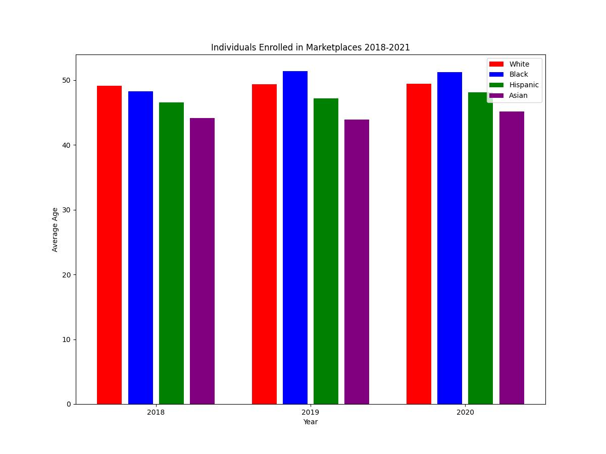
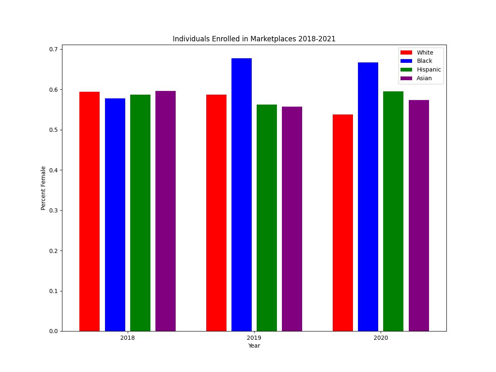
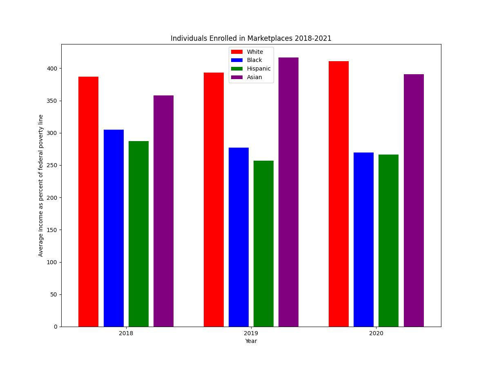
.jpeg)
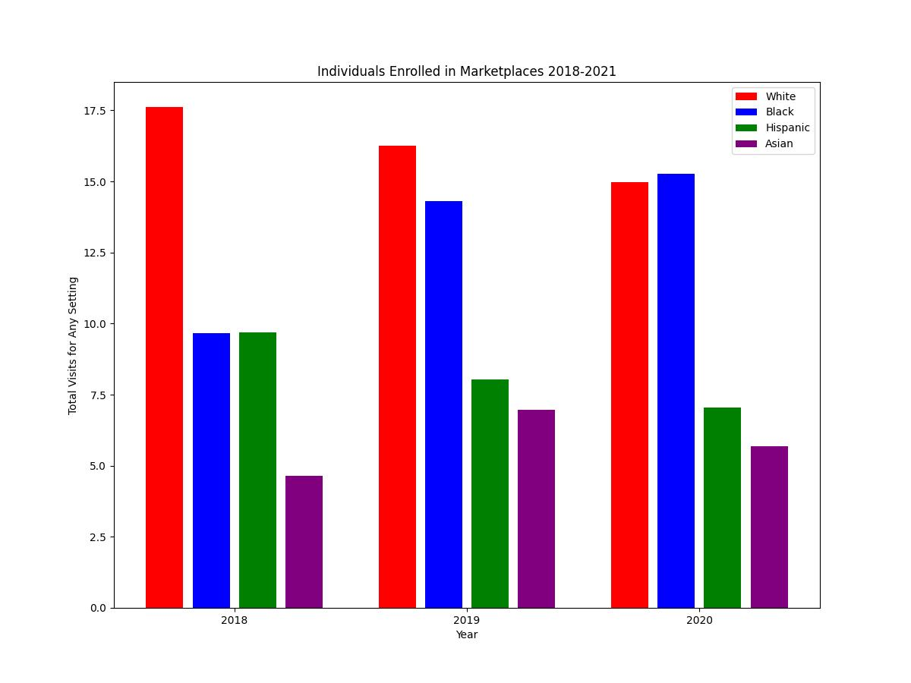
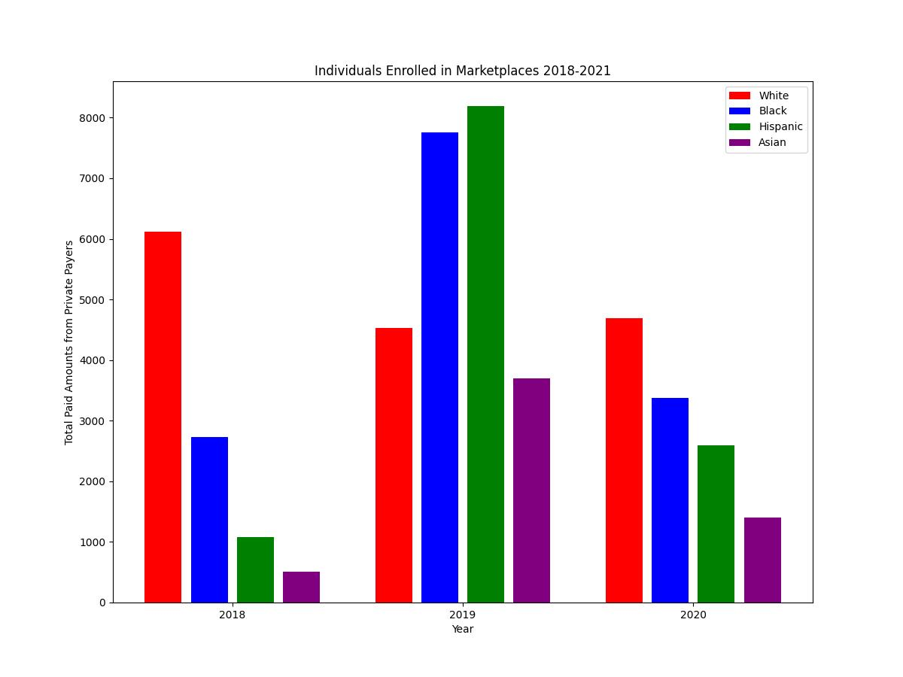

#### Regression Results
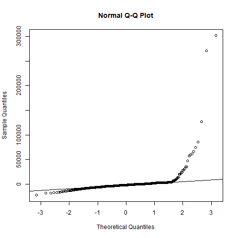
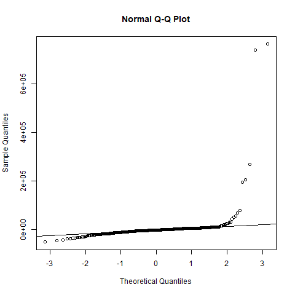
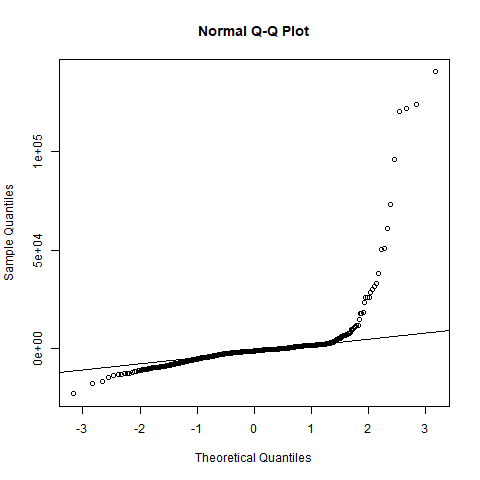
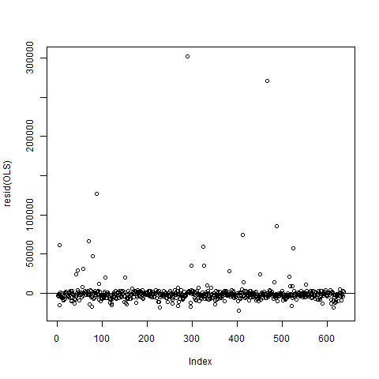
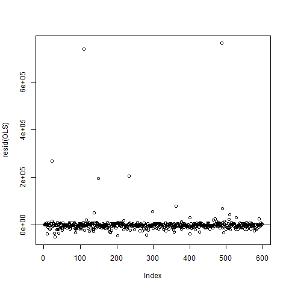
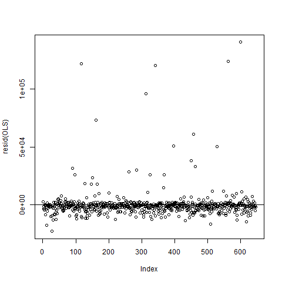

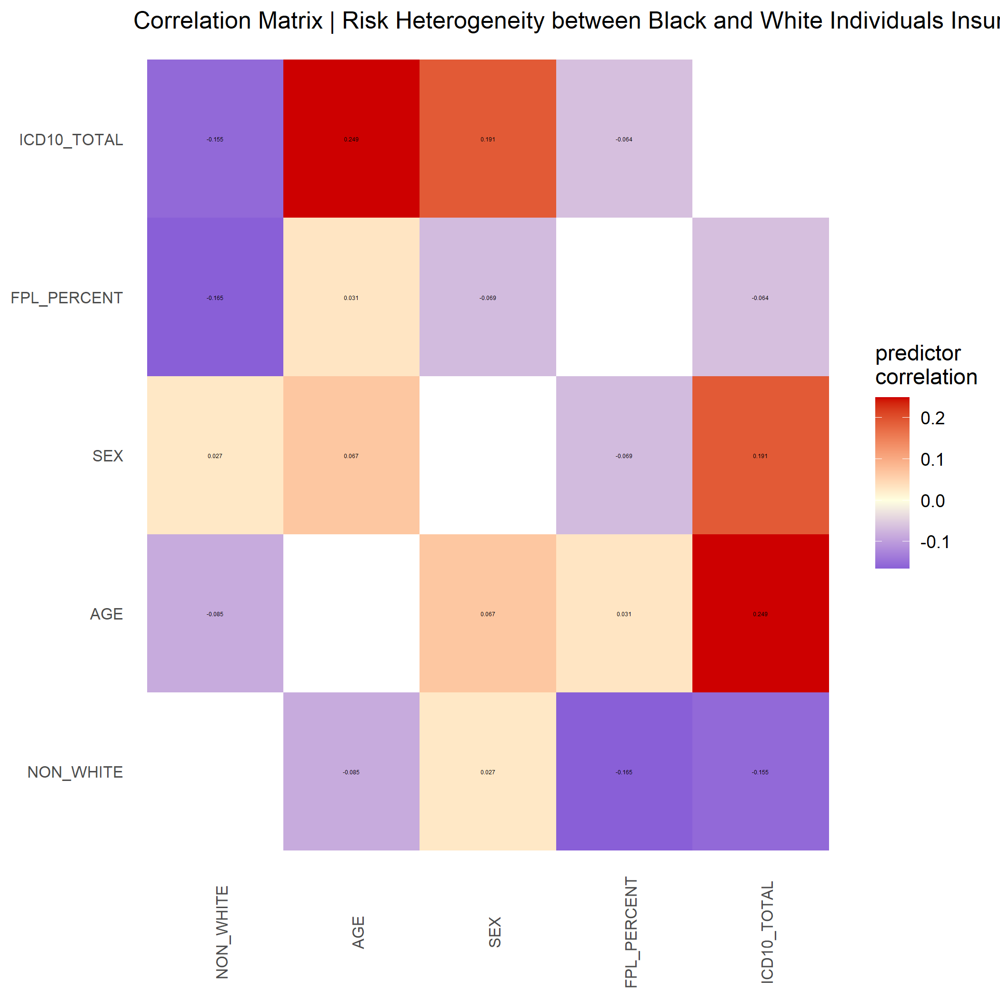

